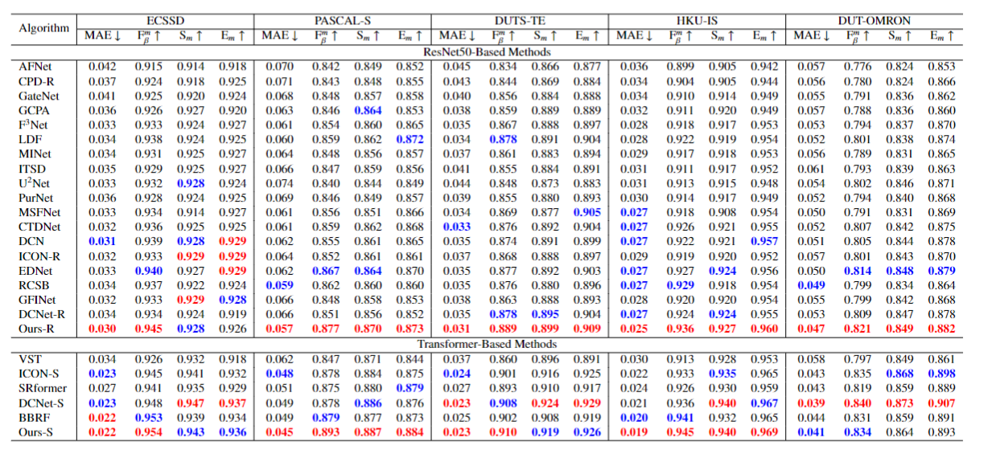

# Salient-Object-Detection
#### 显著目标检测论文集合
Download from the following urls
[[Google Drive]](https://drive.google.com/file/d/1YJKSzszzRUskCvI4DorMBz_43ge66WsY/view?usp=drive_link)

#### 显著目标检测数据下载
Download from the following urls
[[Google Drive]]()


#### 评估数据集

```
cd src
python evaluate.py
```

#### 绘制PR曲线和F值曲线
```
cd src
python PR-curve.py
python F-measure.py
```

#### 将不同模型的图片绘制到一张图片中

```
cd src
python model_duibi.py
```

###统计的数据
